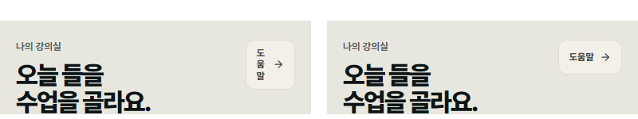

# 한국어 줄바꿈 — 실서비스 적용 결과 (2026-10-08)

대상: 김은광 수능국어(ekkorean.com)의 학생 웹 화면. Next.js 16 · Tailwind v4 웹 + Expo 57 / React Native 0.86 앱.
측정: 이 저장소의 `korean-line-break` 검출기. 학생 화면 12개(오늘·학습 허브·1일 1지문·1일 1작품·문학 해설·강의·주간 리포트 등)를 합성 데이터로 오프라인 렌더한 뒤, 폭 320·390·768·1440px × Chromium 147·WebKit 26.4·Firefox 148에서 검사했다(화면 12 × 폭 4 × 엔진 3 = 144회).

## 1. 렌더 결과 (적용 전 → 적용 후)

| 엔진 | 오류(error) | 경고(warn) |
|---|---|---|
| Chromium | 41 → **3** | 23 → 8 |
| WebKit | 41 → **3** | 21 → 4 |
| Firefox | 33 → **2** | 0 → 0 |

| 유형 | 적용 전 | 적용 후 |
|---|---|---|
| 어절 중간 끊김(mid-eojeol) | 93 | 6 |
| 조사 줄머리(josa-head) | 6 | 0 |
| 외톨이 줄 오류(orphan, 12자 이상 문단) | 16 | 2 |
| 외톨이 줄 경고 | 44 | 8 |
| 긴 어절 분할 경고(long-eojeol-split) | 0 | 4 |

- 적용 후 남은 오류는 모두 **작품 원문(시 행)** 요소다. 작품 원문은 고유 콘텐츠라 일부러 바꾸지 않았다(원문 요소의 줄 나뉨은 적용 전후 36/36 동일).
- 레이아웃 회귀: 캡처 72장(화면 12 × 폭 3 × 라이트·다크)에서 가로 넘침 0 → 0, 12px 미만 글자·작은 터치 영역 수 변화 없음.
- 대표 사례: 강의 화면 머리의 `도/움/말` 세로 쌓임(좁은 링크, keep-all 없음) → 한 줄. 홈 `확인하⏎세요`, `반영⏎돼요` 같은 어절 중간 끊김 제거.

## 2. 코드 정적 검사 (적용 전 → 적용 후)

| 규칙 | 전 | 후 | 비고 |
|---|---|---|---|
| `word-break: break-word`(비권장) | 1 | 0 | |
| 한국어 칸의 `break-all` | 10 | 3 | 남은 3건은 ASCII ID·scope 칸 |
| 링크 하위 `[&_a]:break-all` | 6 | 0 | `wrap-anywhere`로 교체 |
| `pre-wrap/pre-line`에 넘침 대비 없음 | 76 | 7 | 남은 7건은 부모·다음 줄 선언(검사기 한계) |
| `@layer` 밖 줄바꿈 클래스 | 107 | 104 | 전역 `.ko-*` 3건 이동. 나머지는 지면별 스코프 CSS |

변경 규모: 웹 69파일(+316/−126), 앱 21파일. `tsc` 0, 단위 테스트 웹 21·앱 27 통과, `next build` 통과(정적 페이지 440).

## 3. 엔진 실험 (검출기 픽스처·306문단)

| 조건 | Chromium 147 | WebKit 26.4 | Firefox 148 |
|---|---|---|---|
| keep-all만 | 외톨이 4 | 외톨이 4 | 외톨이 4 |
| keep-all + `text-wrap: pretty` | 0 | 0 | 4(미지원) |
| `(가)와`·`〈보기〉에서`·`㉠에서` (keep-all) | 조사 줄머리로 끊음 | 붙임(대신 넘침) | 괄호류 끊음 |
| 같은 문구를 nowrap 묶음으로 | 0 | 0 | 0 |

- 디자인 시안 58장(320·390px)에서도 고전 시가 한자 병기 뒤 조사 분리(`혼백(魂魄)⏎조차`), 따옴표 뒤 조사(`‘반기실가’⏎는`)를 잡았다.
- 검출 속도: 페이지당 30~55ms.

## 4. 운영 사이트에서 찾은 실제 결함(적용 전, GET 측정)

- 홈 1440px: `(등급컷·운영·독서⏎·문학)` — keep-all + pretty 상태에서도 Chromium이 가운뎃점에서 끊음.
- 수업 안내 화면 390px 후기 표: `올랐어요.”` 한 줄 외톨이. 홈 1440px: `만들어집니다.` 외톨이 — 둘 다 pretty가 빠진 요소.



## 5. 이 저장소에서 재현하기

Node.js 18+와 Playwright가 필요하다. 설치 방법은 [저장소 README](../../README.md#설치)를 따른다. 저장소 루트에서 실행한다.

```bash
node skills/korean-line-break/scripts/ko-nobreak.mjs --selftest
node skills/korean-line-break/scripts/rn-ko-lines.mjs --selftest
node --test tests/linebreak_fixture.test.mjs
node skills/korean-line-break/scripts/ko-wrap-check.mjs \
  skills/korean-line-break/scripts/fixture.html --widths 400 \
  --engines chromium,webkit,firefox --fail-on none --out linebreak-fixture.json
node skills/korean-line-break/scripts/ko-wrap-static.mjs src --strict
```

픽스처는 의도적으로 잘못 줄바꿈되는 예제를 포함하므로 위반이 나오는 것이 정상이다. 테스트는 여섯 기대 유형이 발견되고 nowrap 묶음·keep-all+pretty 예제에는 위반이 없는지 확인한다. 정적 검사의 `src`는 검수할 프로젝트의 코드 폴더로 바꾼다.

자신의 화면은 다음처럼 검사한다. 작품 원문은 고유 콘텐츠이므로 검출 대상에서 제외한다.

```bash
node skills/korean-line-break/scripts/ko-wrap-check.mjs public/example.html \
  --widths 320,390,768,1440 --engines chromium,webkit,firefox \
  --ignore '.work-verse, [data-original-text]' --out linebreak-report.json
```

1·2절의 실서비스 144회 집계는 당시 화면·합성 데이터의 측정 기록이다. 해당 화면 전체는 이 저장소에 포함하지 않으므로 공개 픽스처로 같은 총건수를 재현할 수는 없다. [적용 전 집계](student-before.txt)와 [적용 후 집계](student-after.txt)를 함께 제공한다. Safari 27 계열은 아래 WebKit 27.2 측정으로 보완했다.

## Safari 27 계열(WebKit 27.2) 추가 측정

Playwright 1.64의 WebKit 27.2로 같은 화면 12개 × 폭 4개를 다시 검사했다. Safari 27은 `keep-all`에서도 한글 문자열 안 구두점 뒤를 줄바꿈 지점으로 본다(WebKit 커밋 311090@main).

| 엔진 | 오류 적용 전 → 후 | 경고 적용 전 → 후 |
|---|---|---|
| WebKit 27.2 | 43 → 3 | 23 → 6 |

- 적용 전에는 27.2에서만 나타나는 조사 줄머리 2건·여는 괄호 줄끝 2건이 있었고 적용 후 0건이다. 남은 오류 3건은 보호한 작품 원문이다. 집계: [적용 전](student-before-webkit27.txt), [적용 후](student-after-webkit27.txt).
- 같은 엔진에서 `(가)`와 `와` 사이에 U+2060(WJ)를 넣어도 `(가)⁠⏎와`로 끊겼다. `white-space: nowrap` 묶음만 막았다.

## 안드로이드(React Native 0.86) 에뮬레이터 측정

Android 14(API 34) 에뮬레이터, Expo Go 57, 폭 120dp·14sp. en-US와 ko-KR 로캘 결과가 같았다.

| 방식 | 결과 |
|---|---|
| 기본(`highQuality`) | `그래⏎서`, `〈보기〉에⏎서`, `비⏎교`, `확인하⏎기` — 음절 단위 |
| `textBreakStrategy="balanced"` | `매⏎일`, `학⏎생`, `이깁니⏎다` — 더 잘게 끊김 |
| 한글 어절 안 U+2060 삽입 | 모든 문장이 어절 단위, 줄보다 긴 어절만 강제 분할 |

접근성 트리(text)에는 U+2060이 그대로 들어간다. TalkBack 낭독은 실기기에서 확인한다.
